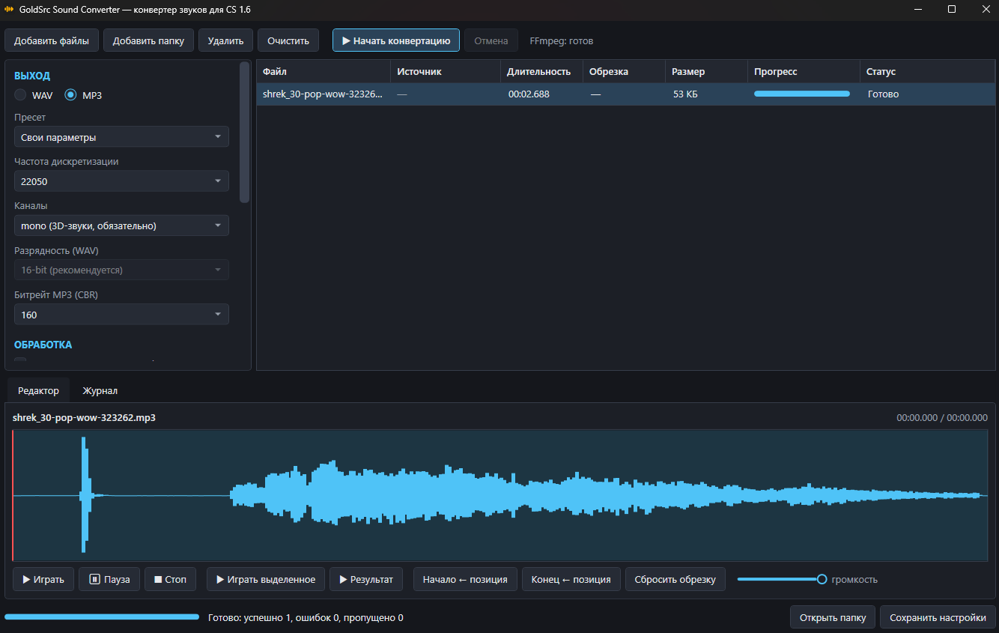

# Goldsrc Sound Converter



Утилита для Windows, которая конвертирует любые звуки и музыку в форматы,
пригодные для воспроизведения в **Counter-Strike 1.6 / GoldSrc** (`.wav` и `.mp3`).

Параметры подбираются автоматически по пресетам движка, поддерживается пакетная
обработка, нормализация громкости, обрезка по волновой форме и прослушивание
исходника/результата прямо в программе.

## Требования

- Windows 10/11.
- Интернет при первом запуске конвертации — программа сама скачает FFmpeg
  (фиксированная версия с проверкой SHA-256) в
  `%LocalAppData%\GoldsrcSoundConverter\ffmpeg`. Можно вместо этого указать свой
  `ffmpeg.exe` в настройках.
- Для сборки из исходников — .NET 10 SDK.

## Быстрый старт

1. Добавьте файлы или папки (кнопки или drag&drop, папки обходятся рекурсивно).
2. Выберите формат **WAV** или **MP3** и пресет.
3. Укажите папку результатов.
4. Нажмите **▶ Начать конвертацию**.

## Пресеты (GoldSrc / CS 1.6)

| Пресет | Параметры | Для чего |
| --- | --- | --- |
| WAV — звуки | 22050 Hz, 16-bit, mono | серверные звуки (`sound/`), 3D через `ambient_generic`, `spk` |
| WAV — голос/UI | 11025 Hz, 16-bit, mono | голос, интерфейс, старые звуки Half-Life |
| WAV — экономичный | 22050 Hz, 8-bit, mono | минимальный размер, 8-bit PCM |
| WAV — музыка/2D | 44100 Hz, 16-bit, stereo | только 2D-звуки (3D-звуки должны быть mono) |
| MP3 — музыка | 44100 Hz, CBR 128k, stereo | музыка в `mp3/`, команда `mp3 play` |
| MP3 — музыка HQ | 44100 Hz, CBR 192k, stereo | музыка, если нужен запас по качеству |
| MP3 — голос/радио | 22050 Hz, CBR 64k, mono | длинные записи, радио |

MP3 пишется в **CBR** (VBR движок не поддерживает) и **без ID3v2-тегов**.
Для `sound/` по умолчанию используется mono — stereo не работает для позиционных
3D-звуков. Движок GoldSrc гарантированно поддерживает 8/16-bit PCM и частоты
11025/22050 Hz (44100 движок может ресемплить сам).

## Возможности

- Пакетная конвертация в несколько потоков, прогресс, ETA, отмена, журнал и
  продолжение при ошибках отдельных файлов.
- Нормализация пика (по умолчанию цель −0.3 dBFS, ограничение усиления 24 dB).
- Редактор: волновая форма, выделение мышью, маркеры начала/конца, воспроизведение
  исходника и результата с обрезкой.
- ASCII-имена (транслит кириллицы), нижний регистр, сохранение структуры папок,
  политики при совпадении имён (переименовать/перезаписать/пропустить).
- Настройки и размер окна сохраняются в `%AppData%\GoldsrcSoundConverter\settings.json`.

## Входные форматы

Всё, что декодирует FFmpeg: wav, mp3, ogg/opus, flac, m4a/aac, wma, aiff, ac3, wv,
ape, а также аудиодорожки из mp4/mkv/mov/avi/webm.

## Сборка

```powershell
dotnet build
dotnet test
.\publish.ps1                 # тесты + self-contained single-file exe + zip
.\publish.ps1 -SkipTests      # без прогона тестов
.\publish.ps1 -Version 1.1.0  # версия без правки csproj
.\publish.ps1 -NoZip          # только папка publish/win-x64
```

Результат релиза:

- `publish/win-x64/GoldsrcSoundConverter.exe` — автономный (self-contained),
  .NET у пользователя не требуется; FFmpeg по-прежнему скачивается при первом
  запуске конвертации;
- `publish/GoldsrcSoundConverter-<версия>-win-x64.zip` — этот же exe плюс
  краткая инструкция «Как пользоваться.txt» для конечного пользователя.

Перед публикацией папка `publish/win-x64` полностью очищается, символы отладки
и папки локализаций не создаются — в релиз попадает только exe и инструкция.

## Архитектура

```
Core  — бизнес-логика: AudioConverter/BatchConverter/ConversionPlanner,
        InputFileDiscoverer, Ffmpeg-обвязка и манифест FFmpeg, настройки,
        пресеты, волновая форма, кэш предпросмотра. Не зависит от WPF.

App   — WPF и платформенные интеграции:
        ViewModels/{MainViewModel, QueueItemViewModel};
        Services/{ConversionService, ConversionRunController, QueueManager,
                  PlaybackCoordinator, WaveformLoader, PresetCatalog,
                  ConversionRequestFactory, LogBuffer};
        Infrastructure/{Audio (NAudio), FilePicker, Shell};
        Composition/ServiceCollectionExtensions — DI-композиция,
        App.xaml.cs — Generic Host.

Tests — GoldsrcSoundConverter.Core.Tests (net10.0) и
        GoldsrcSoundConverter.App.Tests (net10.0-windows) на fake-сервисах;
        интеграционные тесты с реальным FFmpeg помечены категорией Integration
        и пропускаются, если FFmpeg недоступен.
```

Правила зависимостей:

- Core не знает про WPF, диалоги, `Application.Current` и не запускает процессы напрямую.
- ViewModel не создаёт инфраструктуру (`new`), а получает сервисы через конструктор.
- Application-сервисы (`ConversionService`, `ConversionRunController`) работают только с
  Core-моделями; `QueueItemViewModel` мутируют только presentation-сервисы (`QueueManager`,
  `WaveformLoader`, `QueueConversionPresenter`) и сама ViewModel.
- UI-специфичный код (DWM-заголовок, drag&drop, автоскролл) остаётся в `MainWindow.xaml.cs`.

## Разработка

```powershell
dotnet restore
dotnet build
dotnet test                                      # всё, интеграционные пропустятся без FFmpeg
dotnet test --filter "Category!=Integration"     # только unit-тесты
dotnet test --filter "Category=Integration"      # только интеграционные (нужен FFmpeg)
```

Интеграционные тесты ищут FFmpeg в переменной `GSC_FFMPEG`, затем в
`%LocalAppData%\GoldsrcSoundConverter\ffmpeg`, затем в `PATH`.

В проекте включены `AnalysisLevel=latest-recommended` и
`EnforceCodeStyleInBuild`; сборка должна проходить без предупреждений
(CA1716 подавлен: имена вида `Stop` заданы контрактами).

## Политика FFmpeg

Версия FFmpeg зафиксирована в `src/GoldsrcSoundConverter.Core/Ffmpeg/ffmpeg.manifest.json`
(version/url/sha256), который встраивается в сборку как ресурс
(`FfmpegManifestLoader`). Архив скачивается с GitHub-релизов gyan.dev и всегда
проверяется по SHA-256. Обновление версии — отдельное осознанное изменение:
version, URL и checksum меняются вместе; CI читает тот же манифест.

## Непрерывная интеграция

`.github/workflows/ci.yml` на каждый push и pull request выполняет restore,
Release-сборку и полный прогон тестов (включая интеграционные). CI скачивает ту же
зафиксированную сборку FFmpeg, проверяет её SHA-256 и передаёт путь через
`GSC_FFMPEG`.

## Релиз

Тег вида `v1.1.0` запускает `.github/workflows/release.yml`: workflow собирает
архив через `publish.ps1 -SkipTests` и создаёт GitHub Release с
`GoldsrcSoundConverter-<версия>-win-x64.zip`. Локально тот же результат даёт
`.\publish.ps1 -Version 1.1.0`.
